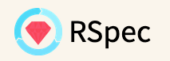

# 

[![Gem Version][gem-image]][gem-link]
[![MIT licensed][license-image]][license-link]
[![Build Status][build-image]][build-link]

[Documentation]

## About

HTTP (The Gem! a.k.a. http.rb) is an easy-to-use client library for making requests
from Ruby. RSpec is a Behaviour Driven Development spec libary for Ruby. Making TDD 
Productive and Fun.

This gem adds custom matchers to make it easier to check http requests.

## Installation

Add the gem to your gemfile with bundler 
```bash 
$ bunlde add http_rspec
```

Inside of your spec helper (default spec_helper.rb):
```ruby
require "http/rspec"
```

Now you have to include the matchers you want for the blocks you want
```ruby
# in spec_helper.rb to include matchers everywhere
RSpec.configure do |config|
  config.include HTTP::Support::RspecMatchers
end

# in spec_helper.rb to include where the type is service
RSpec.configure do |config|
  config.include HTTP::Support::RspecMatchers, type: :service
end

# in the individual describe blocks
RSpec.describe Service do
  include HTTP::Support::RspecMatchers
 
  it "makes request" do
    expect(response).to be_an_http_gem_response.with(status: 200)
  end
end
```

## Documentation

Most things are documented here in the readme
The following API documentation is also available:

- [YARD API documentation](https://www.rubydoc.info/github/httprb/http_rspec)

### Basic Usage

Here's some simple examples to get you started:

```ruby
  it "has successful response" do 
    response = HTTP.get("www.nrk.no")
    expect(response).to be_an_http_gem_response.with(status: :success) # will match 2xx status code
    expect(response).to be_an_http_gem_response.with(status: :redirect) # will match 3xx status code
    expect(response).to be_an_http_gem_response.with(status: :error) # will match 3xx status code
    
    expect(response).to be_an_http_gem_response.with(status: :ok) # require 200 status code
    expect(response).to be_an_http_gem_response.with(status: 200) # require 200 status code
    expect(response).to be_an_http_gem_response.with(status: :not_found) # require 404 status code
    expect(response).to be_an_http_gem_response.with(status: 404) # require 404 status code
    
    # you can access HTTP::Support::RspecMatchers::STATUS_CODE_TO_SYMBOL to see the full 
    # mapping between code and symbol
  end
```

## Supported Ruby Versions

This library aims to support and is [tested against][build-link]
the following Ruby  versions:

- Ruby 3.0
- Ruby 3.1
- Ruby 3.2

If something doesn't work on one of these versions, it's a bug.

This library may inadvertently work (or seem to work) on other Ruby versions,
however support will only be provided for the versions listed above.

If you would like this library to support another Ruby version or
implementation, you may volunteer to be a maintainer. Being a maintainer
entails making sure all tests run and pass on that implementation. When
something breaks on your implementation, you will be responsible for providing
patches in a timely fashion. If critical issues for a particular implementation
exist at the time of a major release, support for that Ruby version may be
dropped.


## Contributing to http.rb rspec

- Fork http.rb on GitHub
- Make your changes
- Ensure all tests pass (`bundle exec rake`)
- Send a pull request
- If we like them we'll merge them
- If we've accepted a patch, feel free to ask for commit access!


## Copyright

Copyright © 2011-2023 Tony Arcieri, Alexey V. Zapparov, Erik Michaels-Ober, Zachary Anker, Simon Toivo Telhaug
See LICENSE.txt for further details.


[//]: # (badges)

[gem-image]: https://img.shields.io/gem/v/httprb_status?logo=ruby
[gem-link]: https://rubygems.org/gems/http_rspec
[license-image]: https://img.shields.io/badge/license-MIT-blue.svg
[license-link]: https://github.com/httprb/http_rspec/blob/main/LICENSE.txt
[build-image]: https://github.com/httprb/http_rspec/workflows/CI/badge.svg
[build-link]: https://github.com/httprb/http_rspec/actions/workflows/ci.yml

[//]: # (links)

[documentation]: https://github.com/httprb/http_rspec/wiki
[requests]: https://docs.python-requests.org/en/latest/
[llhttp]: https://llhttp.org/
